# 🔄 Flujos de Trabajo de la API - Event Gallery

Este documento describe los flujos de trabajo típicos de la aplicación usando los contratos de la API.

---

## 📋 Tabla de Contenidos

1. [Flujo de Autenticación](#-flujo-de-autenticación)
2. [Flujo de Creación de Evento](#-flujo-de-creación-de-evento)
3. [Flujo de Unirse a un Evento](#-flujo-de-unirse-a-un-evento)
4. [Flujo de Subida de Imágenes](#-flujo-de-subida-de-imágenes)
5. [Flujo de Interacción Social](#-flujo-de-interacción-social)
6. [Flujo de Búsqueda y Exploración](#-flujo-de-búsqueda-y-exploración)
7. [Flujo de Visualización de Galería](#-flujo-de-visualización-de-galería)

---

## 🔐 Flujo de Autenticación

### Registro de Usuario

```mermaid
sequenceDiagram
    participant User
    participant Frontend
    participant API
    participant Database

    User->>Frontend: Ingresa datos de registro
    Frontend->>Frontend: Valida datos (api-validators)
    Frontend->>API: POST /api/auth/register
    API->>Database: Verifica email único
    API->>Database: Verifica username único
    API->>Database: Hash password
    API->>Database: Crea usuario
    API->>Database: Crea sesión
    API->>Frontend: {success: true, data: {user, sessionId}}
    Frontend->>User: Redirige a dashboard
```



**Tipos Usados:**
- `CreateUserRequest`
- `LoginResponse`
- `User`

**Código:**
```typescript
import type { CreateUserRequest, ApiResponse, LoginResponse } from '$lib/types';
import { validateCreateUserRequest } from '$lib/types/api-validators';
import { API_ENDPOINTS } from '$lib/types';

// 1. Validar datos
const userData: CreateUserRequest = {
  email: 'user@example.com',
  username: 'johndoe',
  password: 'SecurePass123',
  fullName: 'John Doe'
};

const validation = validateCreateUserRequest(userData);
if (!validation.valid) {
  throw new Error('Validation failed');
}

// 2. Enviar petición
const response = await fetch(API_ENDPOINTS.AUTH.REGISTER, {
  method: 'POST',
  headers: { 'Content-Type': 'application/json' },
  body: JSON.stringify(userData),
  credentials: 'include'
});

const result: ApiResponse<LoginResponse> = await response.json();

// 3. Manejar respuesta
if (result.success && result.data) {
  // Usuario registrado y con sesión activa
  console.log('Usuario:', result.data.user);
}
```

### Inicio de Sesión

```mermaid
sequenceDiagram
    participant User
    participant Frontend
    participant API
    participant Database

    User->>Frontend: Ingresa credenciales
    Frontend->>Frontend: Valida formato
    Frontend->>API: POST /api/auth/login
    API->>Database: Busca usuario por email
    API->>API: Verifica password
    API->>Database: Crea nueva sesión
    API->>Frontend: {success: true, data: {user, sessionId}}
    Frontend->>Frontend: Guarda cookie de sesión
    Frontend->>User: Redirige a dashboard
```



**Tipos Usados:**
- `LoginRequest`
- `LoginResponse`

---

## 📅 Flujo de Creación de Evento


**Tipos Usados:**
- `CreateEventRequest`
- `EventDetail`
- `UploadRoutes.GetPresignedUrlRequest`

**Código:**
```typescript
import type { CreateEventRequest, EventDetail } from '$lib/types';
import { validateCreateEventRequest } from '$lib/types/api-validators';
import { API_ENDPOINTS } from '$lib/types';

// 1. Preparar datos del evento
const eventData: CreateEventRequest = {
  name: 'Tech Conference 2025',
  description: 'Annual technology conference',
  date: '2025-12-15T09:00:00Z',
  time: '09:00',
  location: 'Convention Center',
  category: 'conference',
  isPrivate: false,
  maxParticipants: 500
};

// 2. Validar
const validation = validateCreateEventRequest(eventData);
if (!validation.valid) {
  console.error('Validation errors:', validation.errors);
  return;
}

// 3. Crear evento
const response = await fetch(API_ENDPOINTS.EVENTS.CREATE, {
  method: 'POST',
  headers: { 'Content-Type': 'application/json' },
  body: JSON.stringify(eventData),
  credentials: 'include'
});

const result = await response.json();

if (result.success && result.data) {
  const event: EventDetail = result.data;
  console.log('Evento creado:', event.id);
  console.log('Código de invitación:', event.inviteCode);
}
```

---

## 🎫 Flujo de Unirse a un Evento

### Por Código de Invitación

```mermaid
sequenceDiagram
    participant User
    participant Frontend
    participant API
    participant Database

    User->>Frontend: Ingresa código de invitación
    Frontend->>API: POST /api/events/validate-invite
    API->>Database: Busca evento por código
    API->>Database: Verifica capacidad
    API->>Frontend: {valid: true, event, canJoin: true}
    
    User->>Frontend: Confirma unirse
    Frontend->>API: POST /api/events/join-by-code
    API->>Database: Verifica no esté ya unido
    API->>Database: Verifica capacidad nuevamente
    API->>Database: Crea event_participant
    API->>Frontend: {success: true, data: {event, message}}
    Frontend->>User: Redirige a evento
```



**Tipos Usados:**
- `ValidateInviteCodeRequest`
- `ValidateInviteCodeResponse`
- `JoinEventResponse`

**Código:**
```typescript
import type { ValidateInviteCodeResponse, JoinEventResponse } from '$lib/types';
import { API_ENDPOINTS } from '$lib/types';

// 1. Validar código de invitación
async function validateInviteCode(code: string) {
  const response = await fetch(API_ENDPOINTS.EVENTS.VALIDATE_INVITE, {
    method: 'POST',
    headers: { 'Content-Type': 'application/json' },
    body: JSON.stringify({ inviteCode: code }),
    credentials: 'include'
  });
  
  const result = await response.json();
  
  if (result.success && result.data) {
    const validation: ValidateInviteCodeResponse = result.data;
    
    if (!validation.valid) {
      throw new Error('Código de invitación inválido');
    }
    
    if (!validation.canJoin) {
      throw new Error(validation.reason || 'No puedes unirte a este evento');
    }
    
    return validation.event;
  }
}

// 2. Unirse al evento
async function joinEvent(inviteCode: string) {
  const response = await fetch(API_ENDPOINTS.EVENTS.JOIN_BY_CODE, {
    method: 'POST',
    headers: { 'Content-Type': 'application/json' },
    body: JSON.stringify({ inviteCode }),
    credentials: 'include'
  });
  
  const result = await response.json();
  
  if (result.success && result.data) {
    const joinResponse: JoinEventResponse = result.data;
    console.log('Unido al evento:', joinResponse.event.name);
    return joinResponse.event;
  }
}

// Uso
const event = await validateInviteCode('TECH2024');
if (event) {
  await joinEvent('TECH2024');
}
```

---

## 📤 Flujo de Subida de Imágenes

### Método 1: Upload Directo

```mermaid
sequenceDiagram
    participant User
    participant Frontend
    participant API
    participant S3
    participant Database

    User->>Frontend: Selecciona imagen
    Frontend->>Frontend: Valida archivo (tipo, tamaño)
    Frontend->>Frontend: Genera thumbnail (opcional)
    Frontend->>API: POST /api/images (FormData)
    API->>S3: Upload imagen original
    API->>S3: Upload thumbnail
    API->>Database: Crea registro de imagen
    API->>Frontend: {success: true, data: {image, message}}
    Frontend->>User: Muestra imagen subida
```



**Tipos Usados:**
- `UploadImageRequest`
- `UploadImageResponse`
- `ImageWithStats`

**Código:**
```typescript
import type { UploadImageResponse } from '$lib/types';
import { validateImageFile } from '$lib/types/api-validators';
import { API_ENDPOINTS } from '$lib/types';

async function uploadImage(
  eventId: string, 
  file: File, 
  title?: string, 
  description?: string
) {
  // 1. Validar archivo
  const fileErrors = validateImageFile(file);
  if (fileErrors.length > 0) {
    throw new Error(fileErrors[0]);
  }
  
  // 2. Crear FormData
  const formData = new FormData();
  formData.append('eventId', eventId);
  formData.append('image', file);
  if (title) formData.append('title', title);
  if (description) formData.append('description', description);
  
  // 3. Subir imagen
  const response = await fetch(API_ENDPOINTS.IMAGES.CREATE, {
    method: 'POST',
    body: formData,
    credentials: 'include'
  });
  
  const result = await response.json();
  
  if (result.success && result.data) {
    const uploadResponse: UploadImageResponse = result.data;
    console.log('Imagen subida:', uploadResponse.image.id);
    return uploadResponse.image;
  }
}
```

### Método 2: Presigned URL (Recomendado para archivos grandes)


---

## ❤️ Flujo de Interacción Social

### Dar Like a una Imagen

```mermaid
sequenceDiagram
    participant User
    participant Frontend
    participant API
    participant Database

    User->>Frontend: Click en botón de like
    Frontend->>API: POST /api/images/:id/like
    API->>Database: Verifica no haya like previo
    API->>Database: Crea image_like
    API->>Database: Actualiza contador
    API->>Frontend: {success: true, data: {liked: true, likeCount: 42}}
    Frontend->>Frontend: Actualiza UI
    Frontend->>User: Muestra animación de like
```



### Agregar Comentario


**Código:**
```typescript
import type { CreateCommentRequest, CommentWithUser } from '$lib/types';
import { validateCreateCommentRequest } from '$lib/types/api-validators';
import { API_ENDPOINTS } from '$lib/types';

// Like
async function likeImage(imageId: string) {
  const response = await fetch(API_ENDPOINTS.IMAGES.LIKE(imageId), {
    method: 'POST',
    credentials: 'include'
  });
  
  const result = await response.json();
  
  if (result.success && result.data) {
    console.log('Liked:', result.data.liked);
    console.log('Total likes:', result.data.likeCount);
  }
}

// Comentar
async function addComment(imageId: string, content: string) {
  const commentData: CreateCommentRequest = { imageId, content };
  
  const validation = validateCreateCommentRequest(commentData);
  if (!validation.valid) {
    throw new Error('Invalid comment');
  }
  
  const response = await fetch(API_ENDPOINTS.COMMENTS.CREATE, {
    method: 'POST',
    headers: { 'Content-Type': 'application/json' },
    body: JSON.stringify(commentData),
    credentials: 'include'
  });
  
  const result = await response.json();
  
  if (result.success && result.data) {
    const comment: CommentWithUser = result.data.comment;
    return comment;
  }
}
```

---

## 🔍 Flujo de Búsqueda y Exploración

### Búsqueda Global

```mermaid
sequenceDiagram
    participant User
    participant Frontend
    participant API
    participant Database

    User->>Frontend: Escribe en barra de búsqueda
    Frontend->>Frontend: Debounce (300ms)
    Frontend->>API: GET /api/search?q=query&type=all
    API->>Database: Busca en eventos (nombre, descripción, ubicación)
    API->>Database: Busca en imágenes (título, descripción)
    API->>Database: Busca en usuarios (username, nombre)
    API->>Frontend: {success: true, data: SearchResults}
    Frontend->>User: Muestra resultados agrupados
```



**Tipos Usados:**
- `SearchRequest`
- `SearchResults`

**Código:**
```typescript
import type { SearchResults } from '$lib/types';
import { API_ENDPOINTS } from '$lib/types';

let searchTimeout: number;

async function search(query: string, type: 'all' | 'events' | 'images' | 'users' = 'all') {
  // Debounce
  clearTimeout(searchTimeout);
  
  return new Promise<SearchResults>((resolve) => {
    searchTimeout = setTimeout(async () => {
      const params = new URLSearchParams({ q: query, type });
      
      const response = await fetch(`${API_ENDPOINTS.SEARCH}?${params}`, {
        credentials: 'include'
      });
      
      const result = await response.json();
      
      if (result.success && result.data) {
        resolve(result.data);
      }
    }, 300);
  });
}

// Uso
const results = await search('tech conference');
console.log('Eventos encontrados:', results.events.length);
console.log('Imágenes encontradas:', results.images.length);
console.log('Usuarios encontrados:', results.users.length);
```

### Filtrado de Eventos

```mermaid
sequenceDiagram
    participant User
    participant Frontend
    participant API
    participant Database

    User->>Frontend: Aplica filtros
    Frontend->>Frontend: Construye query params
    Frontend->>API: GET /api/events?category=music&startDate=...
    API->>Database: Query con filtros
    API->>Database: Obtiene estadísticas
    API->>Frontend: {success: true, data: PaginatedResponse}
    Frontend->>User: Muestra eventos filtrados
```



**Código:**
```typescript
import type { EventFilters, PaginatedResponse, EventWithStats } from '$lib/types';
import { API_ENDPOINTS } from '$lib/types';

async function getEvents(filters: EventFilters = {}) {
  const params = new URLSearchParams();
  
  if (filters.category) params.set('category', filters.category);
  if (filters.search) params.set('search', filters.search);
  if (filters.startDate) params.set('startDate', filters.startDate);
  if (filters.endDate) params.set('endDate', filters.endDate);
  if (filters.page) params.set('page', filters.page.toString());
  if (filters.limit) params.set('limit', filters.limit.toString());
  if (filters.sortBy) params.set('sortBy', filters.sortBy);
  if (filters.sortOrder) params.set('sortOrder', filters.sortOrder);
  
  const response = await fetch(
    `${API_ENDPOINTS.EVENTS.LIST}?${params}`,
    { credentials: 'include' }
  );
  
  const result = await response.json();
  
  if (result.success && result.data) {
    const paginated: PaginatedResponse<EventWithStats> = result.data;
    return paginated;
  }
}

// Uso
const events = await getEvents({
  category: 'music',
  startDate: '2025-01-01T00:00:00Z',
  endDate: '2025-12-31T23:59:59Z',
  page: 1,
  limit: 20,
  sortBy: 'date',
  sortOrder: 'desc'
});

console.log(`Página ${events.pagination.currentPage} de ${events.pagination.totalPages}`);
console.log(`Total: ${events.pagination.totalItems} eventos`);
```

---

## 🎨 Flujo de Visualización de Galería

### Cargar Imágenes de un Evento

```mermaid
sequenceDiagram
    participant User
    participant Frontend
    participant API
    participant Database
    participant CDN

    User->>Frontend: Accede a página del evento
    Frontend->>API: GET /api/events/:id
    API->>Database: Obtiene evento + estadísticas
    API->>Frontend: EventDetail
    
    Frontend->>API: GET /api/events/:id/images?page=1&limit=20
    API->>Database: Obtiene imágenes con estadísticas
    API->>Frontend: PaginatedResponse<ImageWithStats>
    
    Frontend->>CDN: Carga thumbnails
    CDN->>Frontend: Imágenes optimizadas
    Frontend->>User: Muestra galería
    
    User->>Frontend: Scroll hacia abajo
    Frontend->>API: GET /api/events/:id/images?page=2&limit=20
    API->>Frontend: Siguiente página
    Frontend->>User: Agrega más imágenes
```



**Código:**
```typescript
import type { EventDetail, PaginatedResponse, ImageWithStats } from '$lib/types';
import { API_ENDPOINTS } from '$lib/types';

class EventGallery {
  private eventId: string;
  private currentPage = 1;
  private hasMore = true;
  private loading = false;
  
  images: ImageWithStats[] = [];
  event: EventDetail | null = null;
  
  constructor(eventId: string) {
    this.eventId = eventId;
  }
  
  async loadEvent() {
    const response = await fetch(
      API_ENDPOINTS.EVENTS.GET(this.eventId),
      { credentials: 'include' }
    );
    
    const result = await response.json();
    
    if (result.success && result.data) {
      this.event = result.data;
    }
  }
  
  async loadImages() {
    if (this.loading || !this.hasMore) return;
    
    this.loading = true;
    
    try {
      const params = new URLSearchParams({
        page: this.currentPage.toString(),
        limit: '20',
        sortBy: 'uploadedAt',
        sortOrder: 'desc'
      });
      
      const response = await fetch(
        `${API_ENDPOINTS.EVENTS.IMAGES(this.eventId)}?${params}`,
        { credentials: 'include' }
      );
      
      const result = await response.json();
      
      if (result.success && result.data) {
        const paginated: PaginatedResponse<ImageWithStats> = result.data;
        
        this.images.push(...paginated.data);
        this.hasMore = paginated.pagination.hasNextPage;
        this.currentPage++;
      }
    } finally {
      this.loading = false;
    }
  }
  
  async init() {
    await this.loadEvent();
    await this.loadImages();
  }
}

// Uso
const gallery = new EventGallery('event-uuid-here');
await gallery.init();

console.log('Evento:', gallery.event?.name);
console.log('Imágenes cargadas:', gallery.images.length);

// Implementar infinite scroll
window.addEventListener('scroll', async () => {
  const { scrollTop, scrollHeight, clientHeight } = document.documentElement;
  
  if (scrollTop + clientHeight >= scrollHeight - 100) {
    await gallery.loadImages();
  }
});
```

---

## 📊 Flujo de Dashboard del Usuario

```mermaid
sequenceDiagram
    participant User
    participant Frontend
    participant API
    participant Database

    User->>Frontend: Accede a dashboard
    Frontend->>API: GET /api/auth/me
    API->>Frontend: User data
    
    parallel
        Frontend->>API: GET /api/users/:id/statistics
        API->>Database: Calcula estadísticas
        API->>Frontend: UserStatistics
    and
        Frontend->>API: GET /api/users/:id/events?page=1
        API->>Frontend: Eventos del usuario
    and
        Frontend->>API: GET /api/users/:id/images?page=1
        API->>Frontend: Imágenes del usuario
    and
        Frontend->>API: GET /api/activity/user/:id
        API->>Frontend: Actividad reciente
    end
    
    Frontend->>User: Muestra dashboard completo
```

---

## 🎯 Mejores Prácticas de Implementación

### 1. Manejo de Errores Consistente

```typescript
async function apiRequest<T>(url: string, options?: RequestInit): Promise<T> {
  try {
    const response = await fetch(url, {
      ...options,
      credentials: 'include'
    });
    
    const result = await response.json();
    
    if (!result.success) {
      // Manejar errores de la API
      if (result.error?.details) {
        // Errores de validación
        console.error('Validation errors:', result.error.details);
      }
      throw new Error(result.error?.message || 'Request failed');
    }
    
    return result.data;
  } catch (error) {
    // Manejar errores de red
    console.error('Network error:', error);
    throw error;
  }
}
```

### 2. Optimistic Updates

```typescript
async function likeImageOptimistic(imageId: string, currentLikeCount: number) {
  // 1. Actualizar UI inmediatamente
  updateUI({ liked: true, likeCount: currentLikeCount + 1 });
  
  try {
    // 2. Enviar petición
    const result = await fetch(API_ENDPOINTS.IMAGES.LIKE(imageId), {
      method: 'POST',
      credentials: 'include'
    });
    
    const data = await result.json();
    
    // 3. Confirmar con datos reales
    if (data.success && data.data) {
      updateUI(data.data);
    }
  } catch (error) {
    // 4. Revertir en caso de error
    updateUI({ liked: false, likeCount: currentLikeCount });
    throw error;
  }
}
```

### 3. Caché de Datos

```typescript
class DataCache<T> {
  private cache = new Map<string, { data: T; timestamp: number }>();
  private ttl: number;
  
  constructor(ttlMinutes: number = 5) {
    this.ttl = ttlMinutes * 60 * 1000;
  }
  
  set(key: string, data: T) {
    this.cache.set(key, { data, timestamp: Date.now() });
  }
  
  get(key: string): T | null {
    const cached = this.cache.get(key);
    
    if (!cached) return null;
    
    const age = Date.now() - cached.timestamp;
    if (age > this.ttl) {
      this.cache.delete(key);
      return null;
    }
    
    return cached.data;
  }
  
  clear() {
    this.cache.clear();
  }
}

// Uso
const eventCache = new DataCache<EventDetail>(5); // 5 minutos TTL

async function getEventCached(id: string): Promise<EventDetail> {
  const cached = eventCache.get(id);
  if (cached) return cached;
  
  const response = await fetch(API_ENDPOINTS.EVENTS.GET(id), {
    credentials: 'include'
  });
  const result = await response.json();
  
  if (result.success && result.data) {
    eventCache.set(id, result.data);
    return result.data;
  }
  
  throw new Error('Failed to load event');
}
```

---

## 📝 Conclusión

Estos flujos de trabajo muestran cómo usar los contratos de la API en escenarios reales. Todos los tipos, validadores y constantes están disponibles en el directorio `src/lib/types/` y se pueden importar según sea necesario.

Para más detalles sobre los contratos específicos, consulta:
- `API_CONTRACTS_README.md` - Documentación completa de la API
- `api-examples.ts` - Más ejemplos de código
- `api-validators.ts` - Funciones de validación
- `api-constants.ts` - Constantes y utilidades


