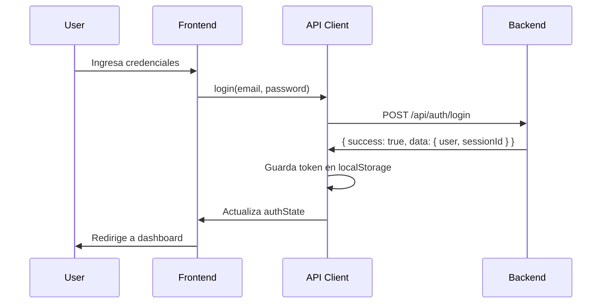
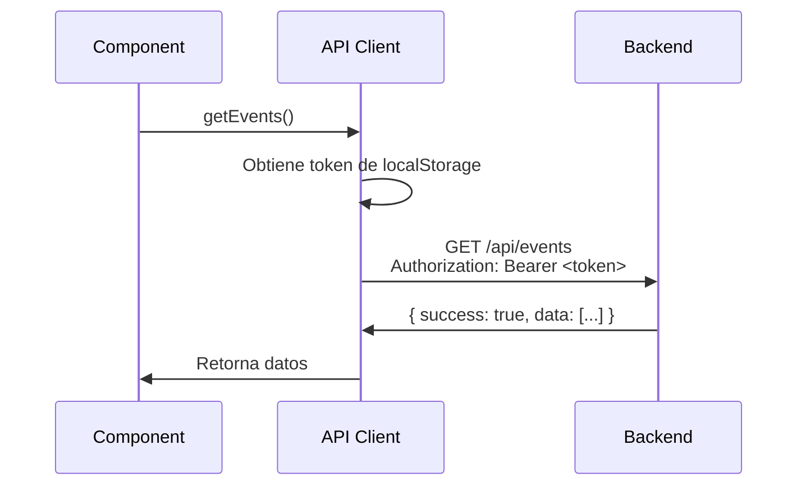
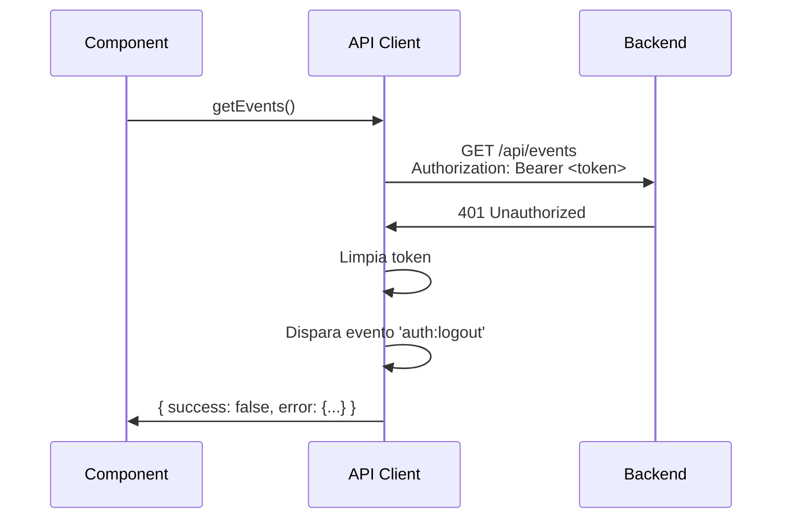

# 🚀 Configuración SPA con Bearer Tokens

Esta aplicación está configurada como **Single Page Application (SPA)** sin Server-Side Rendering (SSR), utilizando autenticación con **Bearer Tokens** para comunicarse con un backend externo.

---

## 📋 Cambios Realizados

### 1. **Configuración de SvelteKit para SPA**

- ✅ **Adapter cambiado**: De `adapter-auto` a `adapter-static`
- ✅ **SSR deshabilitado**: Configurado en `src/routes/+layout.ts`
- ✅ **Fallback configurado**: `index.html` para todas las rutas

### 2. **Cliente API con Bearer Tokens**

- ✅ **Cliente API creado**: `src/lib/api/client.ts`
- ✅ **Gestión de tokens**: Almacenamiento en `localStorage`
- ✅ **Headers automáticos**: `Authorization: Bearer <token>` en todas las peticiones
- ✅ **Manejo de 401**: Logout automático cuando el token expira

### 3. **Store de Autenticación**

- ✅ **Store reactivo**: `src/lib/stores/auth.ts` usando Svelte 5 runes
- ✅ **Estado persistente**: Token y usuario guardados en `localStorage`
- ✅ **Funciones de autenticación**: `login()`, `register()`, `logout()`, `refreshUser()`

### 4. **Contratos de API Actualizados**

- ✅ **LoginResponse**: `sessionId` es el Bearer token
- ✅ **Endpoints**: Configurados para usar API externa
- ✅ **Tipos**: Compatibles con backend externo

---

## 🔧 Configuración

### Variables de Entorno

Crea un archivo `.env` en la raíz del proyecto:

```env
# URL del backend API externo
VITE_API_BASE_URL=http://localhost:3000/api

# Para producción:
# VITE_API_BASE_URL=https://api.tudominio.com/api
```

**Nota**: Las variables de entorno en Vite deben comenzar con `VITE_` para estar disponibles en el cliente.

### Estructura del Backend Esperado

El backend debe:

1. **Autenticación**:
   - `POST /api/auth/register` - Retorna `{ success: true, data: { user, sessionId } }`
   - `POST /api/auth/login` - Retorna `{ success: true, data: { user, sessionId } }`
   - `POST /api/auth/logout` - Cierra sesión
   - `GET /api/auth/me` - Obtiene usuario actual (requiere Bearer token)

2. **Headers requeridos**:
   - `Authorization: Bearer <token>` para endpoints protegidos
   - `Content-Type: application/json` para JSON
   - `Content-Type: multipart/form-data` para uploads

3. **Respuestas**:
   - Formato estándar: `{ success: boolean, data?: T, error?: ApiError }`
   - Código 401: Token inválido o expirado

---

## 📖 Uso

### Importar el Cliente API

```typescript
import { apiClient } from '$lib/api';
// o
import apiClient from '$lib/api/client';
```

### Importar el Store de Autenticación

```typescript
import { 
  authState, 
  login, 
  register, 
  logout, 
  isAuthenticated,
  currentUser 
} from '$lib/stores';
```

### Ejemplo: Login

```typescript
import { login } from '$lib/stores';
import { goto } from '$app/navigation';

async function handleLogin(email: string, password: string) {
  const result = await login(email, password);
  
  if (result.success) {
    // Redirigir a dashboard
    goto('/dashboard');
  } else {
    // Mostrar error
    console.error('Login failed:', result.error);
  }
}
```

### Ejemplo: Usar el Cliente API

```typescript
import { apiClient } from '$lib/api';

// Obtener eventos
const response = await apiClient.getEvents({
  category: 'music',
  page: 1,
  limit: 20
});

if (response.success && response.data) {
  console.log('Eventos:', response.data.data);
}

// Crear evento
const newEvent = await apiClient.createEvent({
  name: 'Mi Evento',
  date: '2025-12-01T00:00:00Z',
  location: 'Ciudad',
  category: 'conference'
});
```

### Ejemplo: Componente con Autenticación

```svelte
<script lang="ts">
  import { authState, logout } from '$lib/stores';
  import { goto } from '$app/navigation';
  
  async function handleLogout() {
    await logout();
    goto('/login');
  }
</script>

{#if $authState.isAuthenticated}
  <p>Bienvenido, {$authState.user?.username}!</p>
  <button on:click={handleLogout}>Cerrar Sesión</button>
{:else}
  <p>No estás autenticado</p>
  <a href="/login">Iniciar Sesión</a>
{/if}
```

---

## 🔐 Flujo de Autenticación

### 1. **Login/Registro**



### 2. **Petición Autenticada**



### 3. **Token Expirado (401)**



---

## 📁 Estructura de Archivos

```
src/
├── lib/
│   ├── api/
│   │   ├── client.ts          # Cliente API con Bearer tokens
│   │   └── index.ts           # Exports del módulo API
│   ├── stores/
│   │   ├── auth.ts            # Store de autenticación
│   │   └── index.ts           # Exports de stores
│   └── types/
│       └── ...                # Contratos de API
├── routes/
│   └── +layout.ts             # SSR deshabilitado
└── hooks.server.ts            # Hooks simplificados (SPA)
```

---

## 🚨 Diferencias con SSR

### ❌ Ya NO se usa:

- `event.locals.user` - No disponible en SPA
- `event.cookies` - No se usan cookies para autenticación
- Server-side load functions - Todo es client-side
- `hooks.server.ts` con lógica de auth - Simplificado

### ✅ Ahora se usa:

- `localStorage` para tokens
- `Bearer tokens` en headers
- Cliente API para todas las peticiones
- Store reactivo para estado de auth

---

## 🔄 Migración de Componentes

### Antes (SSR con cookies):

```typescript
// +page.server.ts
export async function load({ locals }) {
  return {
    user: locals.user
  };
}
```

### Ahora (SPA con Bearer tokens):

```svelte
<script lang="ts">
  import { authState } from '$lib/stores';
  
  // authState es reactivo, se actualiza automáticamente
</script>

<p>Usuario: {$authState.user?.username}</p>
```

---

## 🧪 Testing

Para probar la conexión con el backend:

```typescript
import { apiClient } from '$lib/api';

// Verificar que el token se envía
console.log('Token:', apiClient.getToken());

// Hacer una petición de prueba
const response = await apiClient.getCurrentUser();
console.log('Response:', response);
```

---

## 📝 Notas Importantes

1. **CORS**: El backend debe permitir CORS desde el origen del frontend
2. **HTTPS en producción**: Usa HTTPS para proteger los tokens
3. **Token expiration**: El cliente maneja automáticamente tokens expirados (401)
4. **Refresh tokens**: Si el backend usa refresh tokens, implementa la lógica en `apiClient`
5. **Storage**: Los tokens se guardan en `localStorage` (considera `sessionStorage` para mayor seguridad)

---

## 🐛 Troubleshooting

### Error: "Network request failed"

- Verifica que `VITE_API_BASE_URL` esté configurado correctamente
- Verifica que el backend esté corriendo
- Revisa la consola del navegador para errores CORS

### Error: 401 Unauthorized

- El token puede haber expirado
- Verifica que el token se esté enviando en el header `Authorization`
- Revisa que el backend valide correctamente los Bearer tokens

### Token no se guarda

- Verifica que `localStorage` esté disponible (no en modo incógnito con restricciones)
- Revisa la consola para errores de JavaScript

---

## 📚 Recursos

- [SvelteKit SPA Mode](https://kit.svelte.dev/docs/single-page-apps)
- [Bearer Token Authentication](https://oauth.net/2/bearer-tokens/)
- [Vite Environment Variables](https://vitejs.dev/guide/env-and-mode.html)

---

**Última actualización**: 20 de noviembre de 2025


